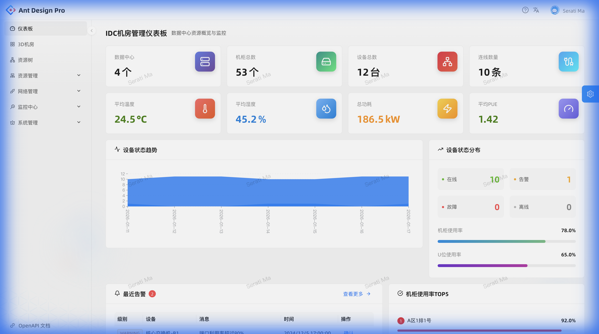
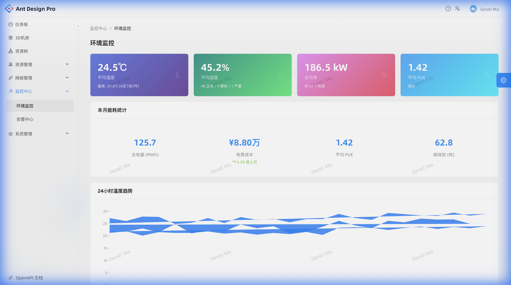
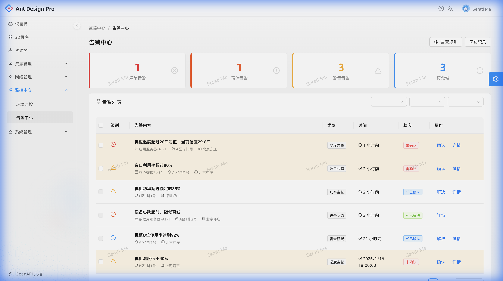
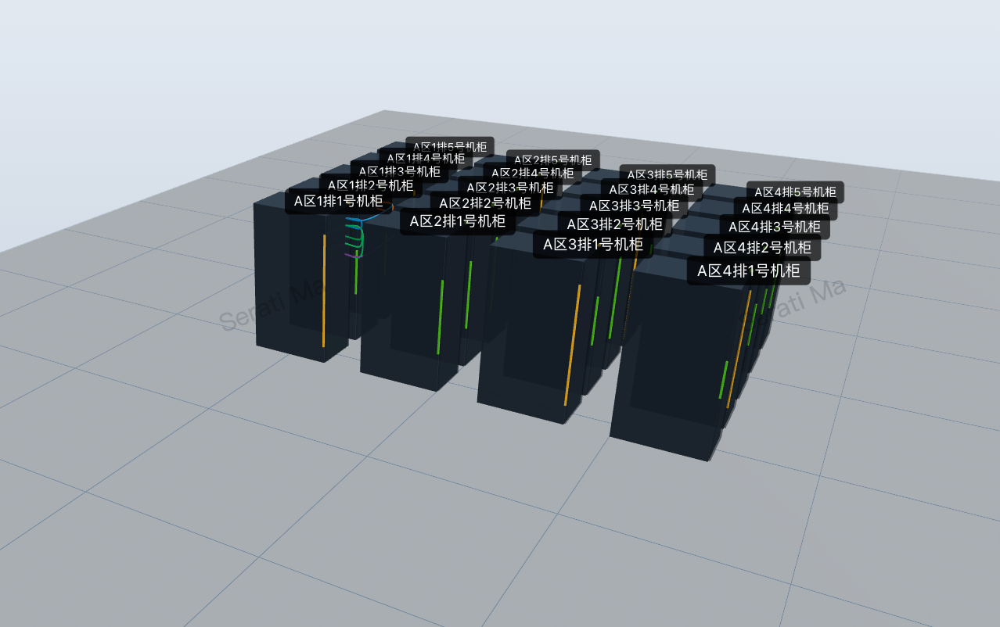
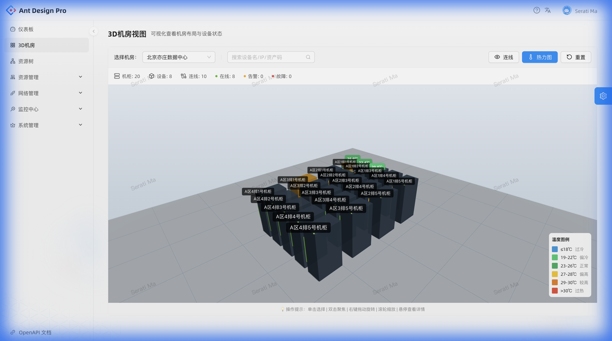
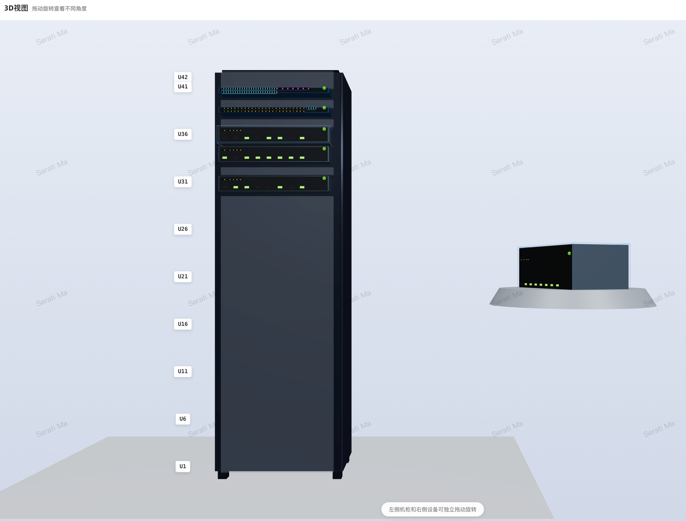
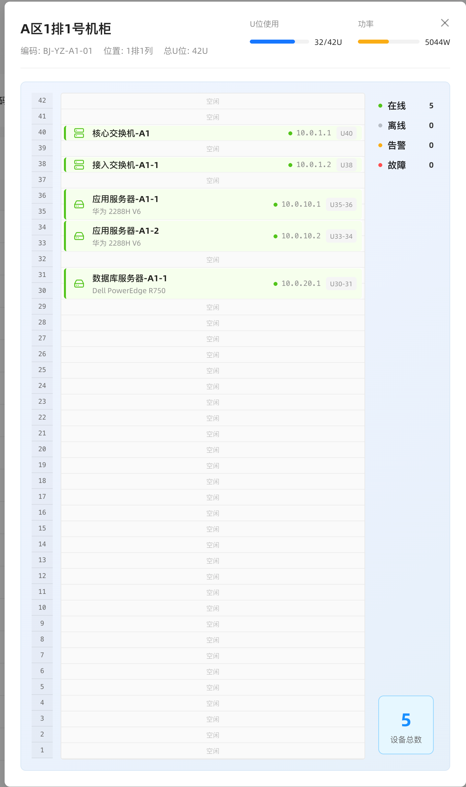
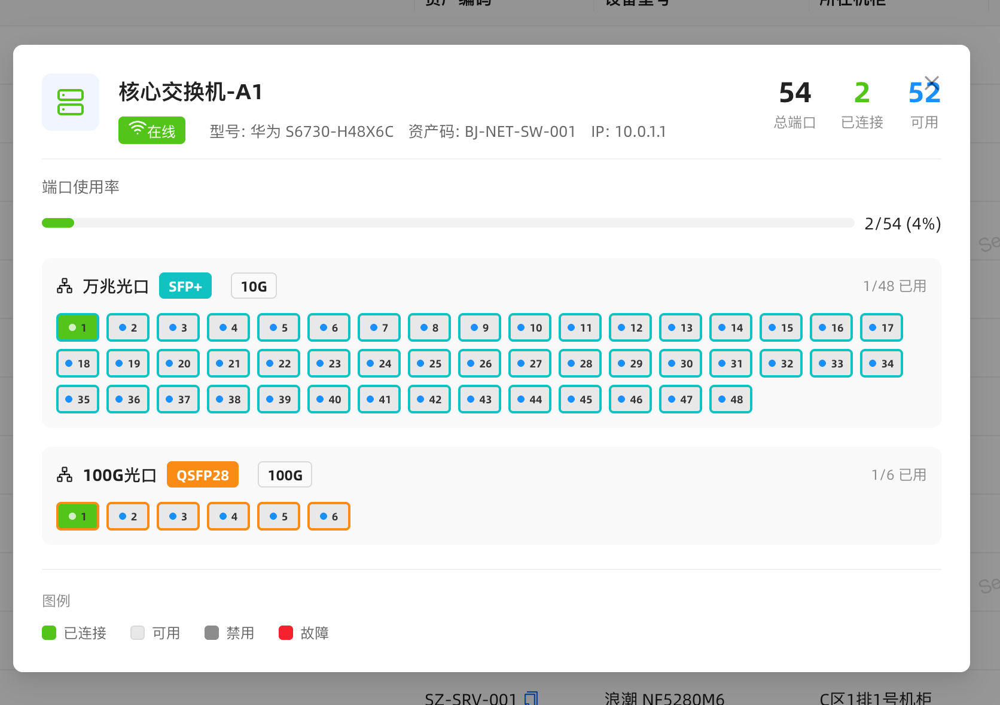
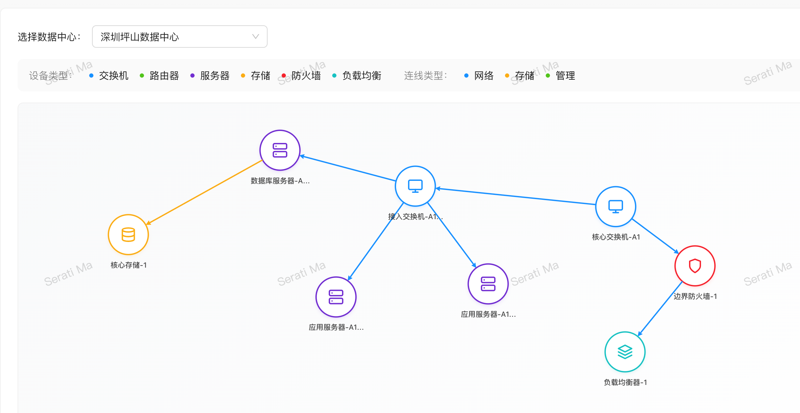

# 3D-DataCenter

<div align="center">

**基于 Three.js 的数据中心 3D 可视化管理系统**

一个现代化的、功能强大的数据中心基础设施管理平台，提供沉浸式的 3D 可视化体验

[English](./README_EN.md) | 简体中文

[](https://react.dev/)
[](https://threejs.org/)
[](https://ant.design/)
[](https://www.typescriptlang.org/)
[](./LICENSE)

</div>

## ✨ 特性

### 🎯 核心功能

- **🏢 数据中心管理** - 完整的数据中心层级管理，从数据中心到机柜到设备
- **📦 机柜可视化** - 真实的 3D 机柜视图，直观展示设备位置和状态
- **🔧 设备管理** - 支持服务器、交换机、路由器等各类设备的全生命周期管理
- **🔌 端口管理** - 详细的网络端口配置和连接关系管理
- **🌐 网络拓扑** - 可视化的网络拓扑图，清晰展示设备间的连接关系
- **📊 资源监控** - 实时监控 U 位使用率、设备状态等关键指标

### �️ 环境监控与能耗管理 (NEW)

- **📈 实时环境监控** - 温度、湿度实时监控与趋势分析
- **⚡ 能耗管理** - 功耗统计、PUE 计算、电费成本分析
- **🔥 3D 热力图** - 机柜温度热力图叠加层，直观显示机房温度分布
- **📉 碳排放统计** - 碳排放量计算与环保指标

### 🔔 告警中心 (NEW)

- **⚠️ 智能告警** - 多级别告警（紧急/错误/警告/信息）
- **📋 告警规则** - 自定义告警阈值和触发条件
- **📜 告警历史** - 完整的告警记录与处理追溯
- **✅ 快速确认** - 一键确认告警，高效处理

### �🎨 3D 可视化体验

- **🖱️ 交互式旋转** - 机柜和设备支持独立拖拽旋转，多角度查看
- **🎯 设备细节展示** - 点击设备可查看放大的 3D 模型，包括前后面板、端口分布
- **🎨 状态可视化** - 不同颜色直观展示设备运行状态（在线/离线/告警）
- **🔥 温度热力图** - 实时温度可视化，颜色映射（蓝→绿→黄→红）
- **⚡ 告警闪烁** - 告警设备动态闪烁效果，快速定位问题
- **📏 精确定位** - U 位标尺清晰标注，设备位置一目了然
- **🌈 真实光影** - 基于物理的渲染，提供接近真实的视觉效果

### 💻 技术亮点

- **⚛️ React 19** - 使用最新的 React 技术栈
- **🎮 Three.js + React Three Fiber** - 高性能 3D 渲染引擎
- **🎨 Ant Design Pro** - 企业级中后台设计体系
- **📱 响应式设计** - 完美适配各种屏幕尺寸
- **🔒 TypeScript** - 完整的类型安全保障
- **🎯 组件化架构** - 高度可复用的组件设计

## 📸 预览

### 仪表板


### 环境监控


### 告警中心


### 数据中心 3D 视图


### 3D 热力图


### 机柜 3D 视图


### 机柜平面布局图


### 设备接口图


### 网络拓扑图


## 🚀 快速开始

### 环境要求

- Node.js >= 20.0.0
- npm 或 yarn 或 pnpm

### 安装

```bash
# 克隆项目
git clone https://github.com/go-laoji/3d-datacenter.git

# 进入项目目录
cd 3d-datacenter

# 安装依赖
npm install
# 或
yarn
# 或
pnpm install
```

### 开发

```bash
# 启动开发服务器
npm start

# 启动开发服务器（无 Mock 数据）
npm run start:no-mock

# 启动开发服务器（连接测试环境）
npm run start:test
```

访问 [http://localhost:8000](http://localhost:8000) 查看应用。

### 构建

```bash
# 构建生产版本
npm run build

# 预览生产构建
npm run preview
```

## 📦 项目结构

```
front/
├── config/              # UmiJS 配置
├── public/              # 静态资源
├── src/
│   ├── components/      # 公共组件
│   │   └── 3d/         # 3D 相关组件
│   │       ├── DeviceModels.tsx      # 设备 3D 模型
│   │       ├── PortRenderer3D.tsx    # 端口渲染器
│   │       └── ...
│   ├── pages/          # 页面组件
│   │   ├── Cabinet3D/       # 机柜 3D 视图
│   │   ├── Datacenter3D/    # 数据中心 3D 视图
│   │   ├── Topology/        # 网络拓扑图
│   │   └── ...
│   ├── services/       # API 服务
│   ├── utils/          # 工具函数
│   └── app.tsx         # 应用入口
├── types/              # TypeScript 类型定义
└── package.json
```

## 🎮 使用指南

### 数据中心管理

1. **创建数据中心** - 在数据中心页面添加新的数据中心
2. **添加机柜** - 为数据中心添加机柜，配置 U 位高度、位置等信息
3. **设备上架** - 在机柜中添加设备，指定起始和结束 U 位
4. **配置端口** - 为设备添加网络端口配置
5. **建立连接** - 创建设备间的网络连接关系

### 3D 视图操作

- **旋转视图** - 在机柜或设备上拖拽鼠标可旋转 3D 模型
- **选择设备** - 点击设备可查看详细信息和放大的 3D 模型
- **查看端口** - 旋转设备可查看前后面板的端口分布
- **切换视角** - 使用控制按钮切换不同的视角和显示模式

## 🛠️ 技术栈

### 前端框架
- [React 19](https://react.dev/) - 用户界面库
- [UmiJS 4](https://umijs.org/) - 企业级前端应用框架
- [Ant Design Pro](https://pro.ant.design/) - 开箱即用的中台前端/设计解决方案

### 3D 渲染
- [Three.js](https://threejs.org/) - JavaScript 3D 库
- [React Three Fiber](https://docs.pmnd.rs/react-three-fiber) - React 的 Three.js 渲染器
- [Drei](https://github.com/pmndrs/drei) - React Three Fiber 实用工具集

### UI 组件
- [Ant Design](https://ant.design/) - 企业级 UI 设计语言和 React 组件库
- [Ant Design Charts](https://charts.ant.design/) - 简单好用的 React 图表库
- [Lucide React](https://lucide.dev/) - 优雅的图标库

### 开发工具
- [TypeScript](https://www.typescriptlang.org/) - JavaScript 的超集
- [Biome](https://biomejs.dev/) - 快速的代码格式化和检查工具
- [Husky](https://typicode.github.io/husky/) - Git hooks 工具
- [Jest](https://jestjs.io/) - JavaScript 测试框架

## 🤝 贡献

我们欢迎所有形式的贡献！如果您想为项目做出贡献，请遵循以下步骤：

1. Fork 本仓库
2. 创建您的特性分支 (`git checkout -b feature/AmazingFeature`)
3. 提交您的更改 (`git commit -m 'Add some AmazingFeature'`)
4. 推送到分支 (`git push origin feature/AmazingFeature`)
5. 开启一个 Pull Request

### 开发规范

- 遵循项目的代码风格
- 确保代码通过 lint 检查：`npm run lint`
- 为新功能添加适当的测试
- 更新相关文档

## 📝 许可证

本项目采用 [MIT](./LICENSE) 许可证。

## 🙏 致谢

- [Three.js](https://threejs.org/) - 强大的 3D JavaScript 库
- [Ant Design](https://ant.design/) - 优秀的 React UI 库
- [React Three Fiber](https://docs.pmnd.rs/react-three-fiber) - 让 Three.js 在 React 中更易用

## 📧 联系方式

如果您有任何问题或建议，欢迎通过以下方式联系我们：

- 提交 [Issue](https://github.com/go-laoji/3d-datacenter/issues)

## 🌟 Star History

[](https://star-history.com/#go-laoji/3d-datacenter&Date)

---

<div align="center">

**如果这个项目对您有帮助，请给我们一个 ⭐️ Star！**

Made with ❤️ by [go-laoji](https://github.com/go-laoji)

</div>
